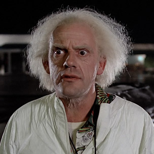

# Git Merge Conflicts


## Introduction

Marty McFly just finished his student profile at The Flation School and now needs to merge his profile with Doc Brown's so they'll both be on the student index page.

## Merging Git Branches

Marty's profile is stored in the `master` branch. Doc's is in the `doc-brown` branch. We are going to merge both branches onto a new branch and resolve the merge conflits there before putting it all back on the master branch.

### Step 1: Make sure you have both branches

Make sure you are in the `master` branch.
- run `git branch` in the terminal, while you're in the "git-merge-conflicts folder, to see all of the branches."

The output should look like this:

```bash
$ git branch
* master
  doc-brown
```

If you do not see the `doc-brown` branch, you will need to fetch it.
- run `git fetch origin/doc-brown`

Now your output should include both branches. (run `git-branch` again to check. If you don't have both branches, grab an instructor or ask a teammate for help.


### Step 2: Make a new merge branch

Create a new branch using `git checkout -b <new branch name>`
- run `git checkout -b merge-index-pages`

You should now be in the `merge-index-pages` branch.

 _(Remember: you can check by running `git branch`)_

### Step 3: Merge!

From the `merge-index-pages` branch, merge the branches `git merge <branch name>`.
 - run `git merge master`

 But wait!!! There's a merge conflict!

```
Auto-merging index.html
CONFLICT (content): Merge conflict in index.html
```

### Step 4: Fix the conflicts

Open up the `index.html` file. Scroll down to around line 93. You should see something that looks like this:

```html
<<<<<<< HEAD
<!-- Begin MARTY MCFLY -->
<li class="home-blog-post">
  <div class="blog-thumb">
    <a href="students/marty_mcfly.html">
      
=======
<!-- Begin DOC BROWN -->
<li class="home-blog-post">
  <div class="blog-thumb">
    <a href="students/doc_brown.html">
      
>>>>>>> doc-brown

... (MORE CODE) ...

```
#### What does it mean!?

Git does its best to merge the code, but sometime sit just doesn't work. We need to complete the merge ourselves by manually adjusting the code. Git gives us a few hints to help us out:

 `<<<<<<< HEAD` - the beginning of the original branch
 `=======` - the end of the original branch/the begining of the new branch (`doc-brown`)
 `>>>>>>> doc-brown` - the end of the new branch ( `doc-brown`)

Take your time and shift the code around, separating the `MARTY MCFLY` and `DOC BROWN` code blocks. Use the markers from  git as a guide.

_Hint: You can also use the HTML tags as guides. If one section ends with an opening `<a>` tag, look for the closing `</a>` tag in the next section._

When you're done the code should look something like this:

 ```html
<!-- Begin MARTY MCFLY -->
<li class="home-blog-post">
  <div class="blog-thumb">
    <a href="students/marty_mcfly.html">
      
    </a>
  </div>

... (MORE CODE) ...

</li>
<!-- End MARTY MCFLY -->

<!-- Begin DOC BROWN -->
<li class="home-blog-post">
  <div class="blog-thumb">
    <a href="students/doc_brown.html">
      
    </a>
  </div>

... (MORE CODE) ...

</li>
<!-- End DOC BROWN -->
 ```

If everything is looking good, we're ready to commit the changes before moving on.
- run `git add index.html` to add all of the changes made in `index.html` to the stage.
- run `git commit -am "merge marty and doc index pages"`.


### Step 5: Merge back to master

Almost done! The next and last step is to the merge this branch back into the master branch.
- run `git checkout master` to get back to the master branch.
- run `git merge merge-index-pages` to merge the `merge-index-pages` branch with master.
- Check your files and make sure everything looks good.
- run `git branch -D merge-index-pages` to delete the `merge-index-pages` branch.

That's it! Open up `index.html` in your browser to see your beautiful work!

## Resources

- [Git Branching - Basic Branching and Merging](http://git-scm.com/book/en/Git-Branching-Basic-Branching-and-Merging)
- [Stack Overflow - Best (and safest) way to merge a git branch into master](http://stackoverflow.com/questions/5601931/best-and-safest-way-to-merge-a-git-branch-into-master)
